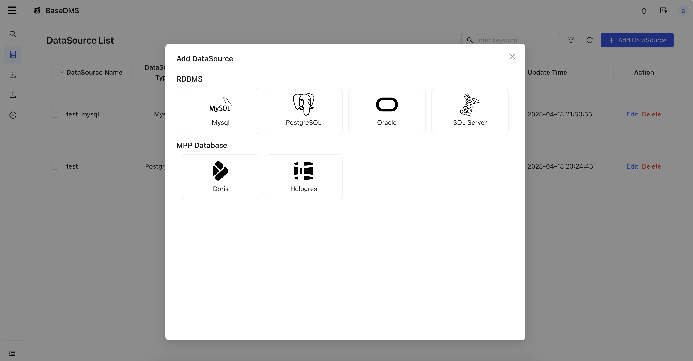
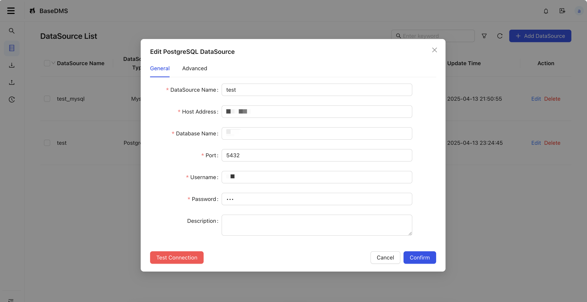
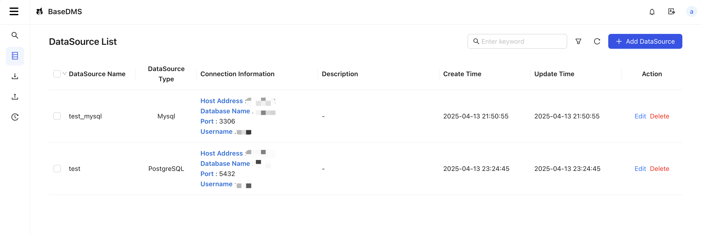

# Datasource

## Supported Datasource

| Type  | Database     |
| ----- | ------------ |
| RDBMS | Mysql        |
| RDBMS | Oracle       |
| RDBMS | PostgreSQL   |
| RDBMS | SQL server   |
| MPP   | Apache Doris |
| MPP   | Hologres     |

## Create Datasource

1. Select Datasource Type
   

2. Add a new datasource, using PostgreSQL as an example
   

3. Click 'Test Connection' and confirm
   
