# SQL Query

## Select Datasource
After opening the workspace, a datasource selection interface will automatically pop up, where you can choose the datasource under the workspace from the dropdown menu.
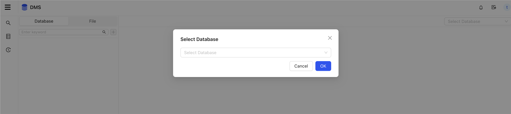
## Create File
You can quickly create files from the database objects list, or right-click to create in the file list.
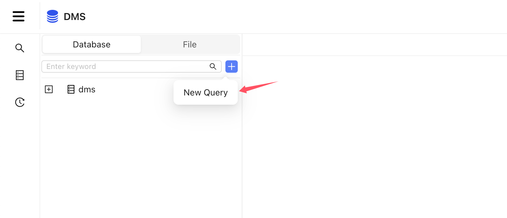
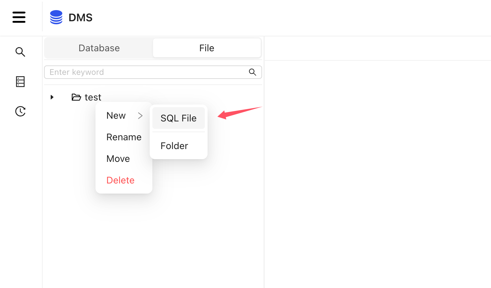
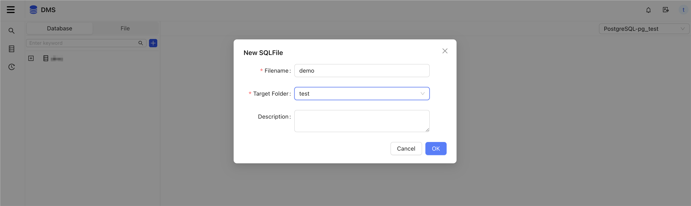
## SQL Query
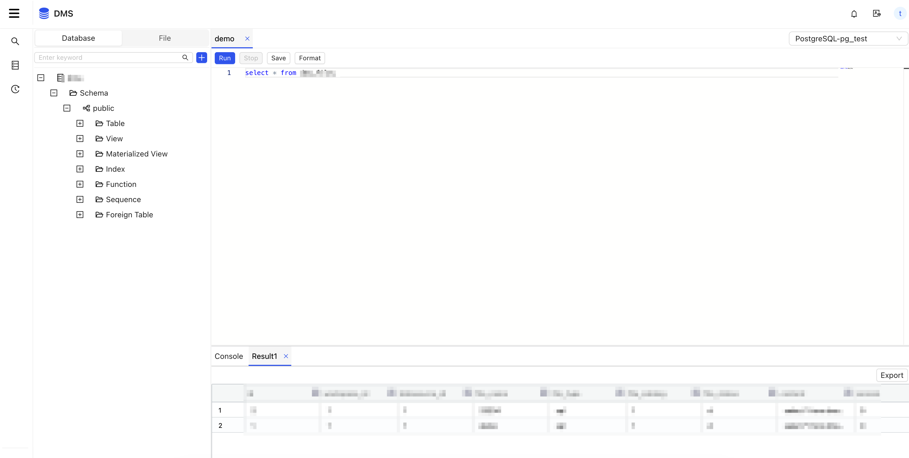
## Data Export
After obtaining the query results, clicking ​Export​ button allows you to choose between ​"Current Table"​ or ​"All Data",The ​"Current Table"​ option only exports the data displayed on the frontend.
The ​"All Data" option generates a back-end export task. You will need to manually download the file after the task completes.
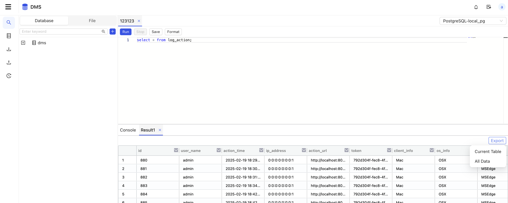
Choose "All Data"
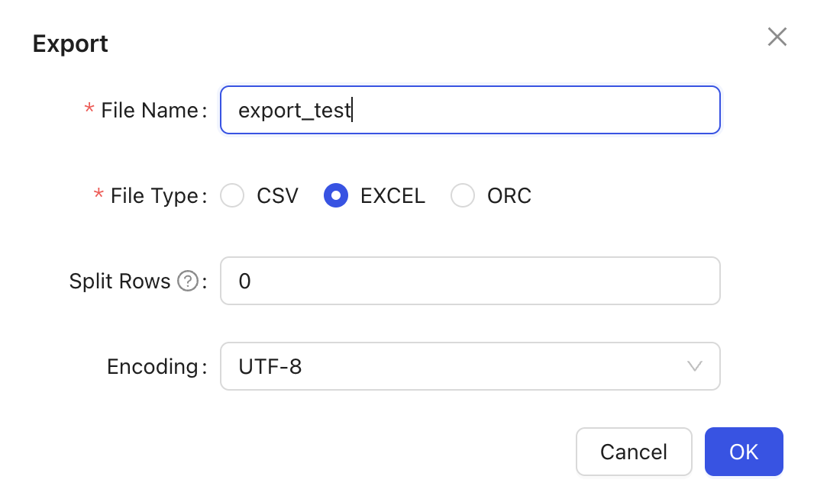
View export result
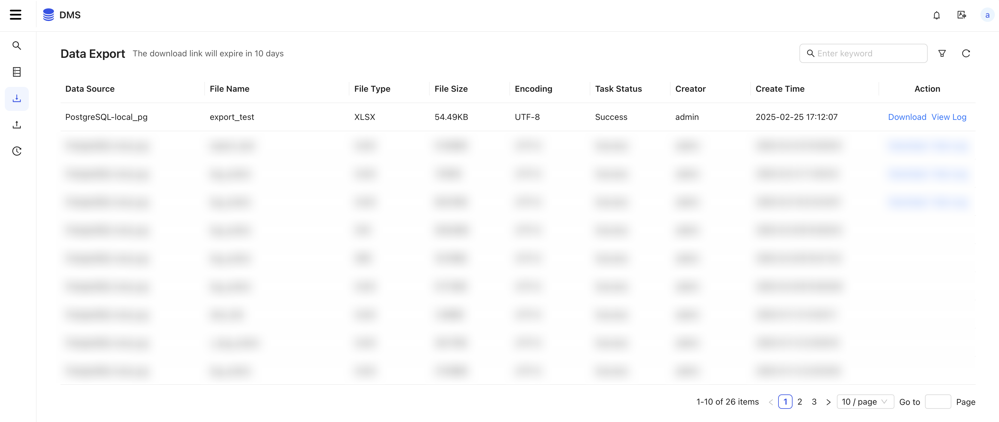
## Data Import
Right-click on a table or view, select ​Import/Export​ from the menu, and then choose ​Import Data from File.
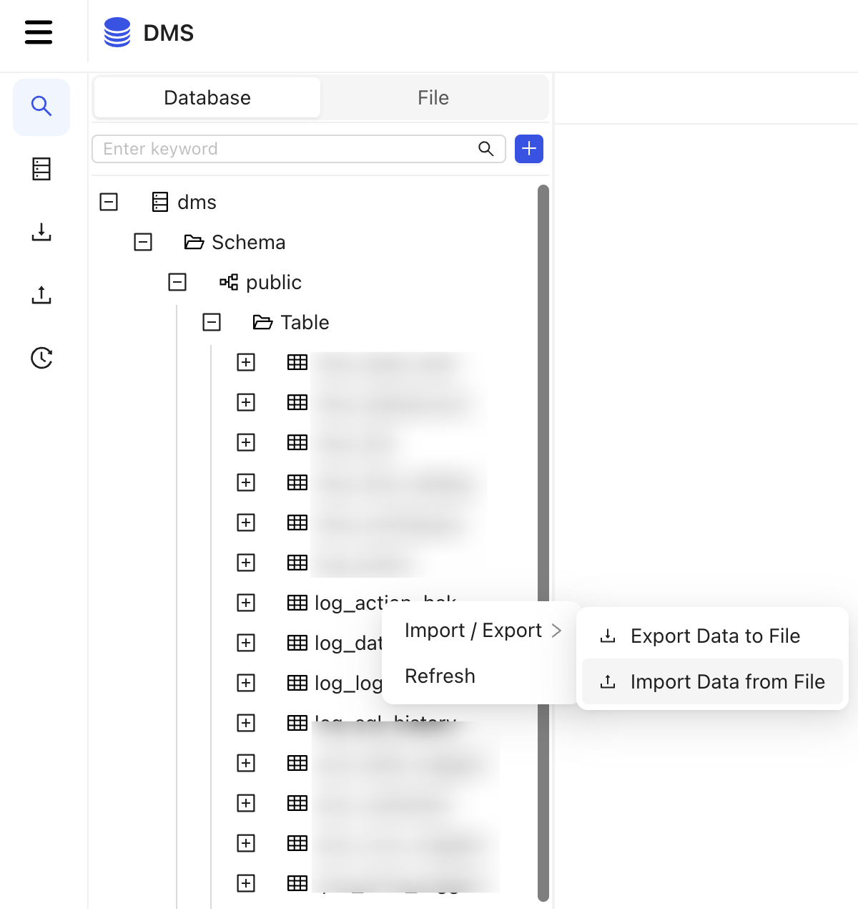
Choose truncate table
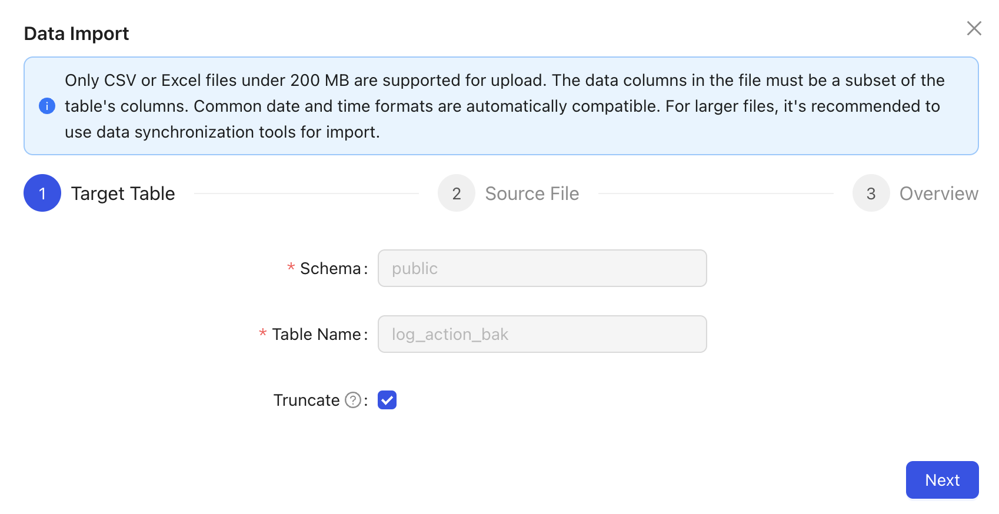
Select file
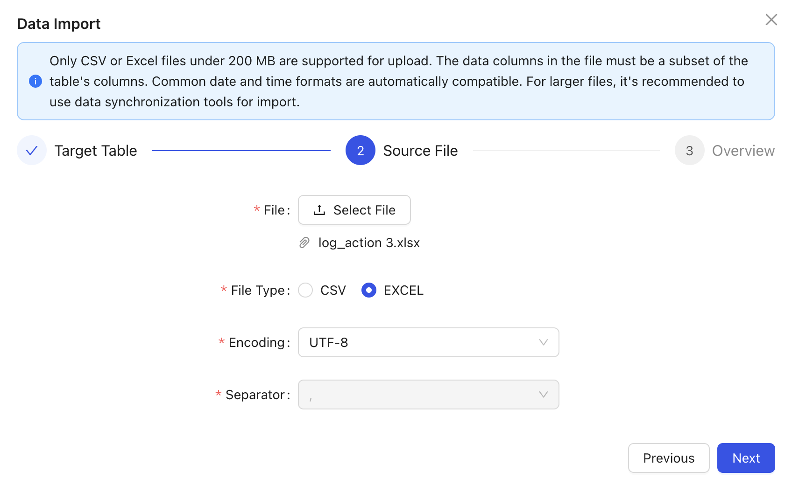
Preview task info
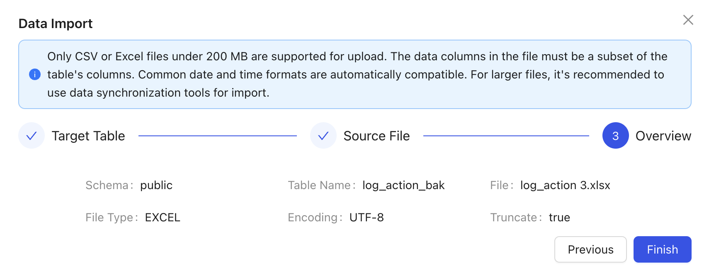
View import result
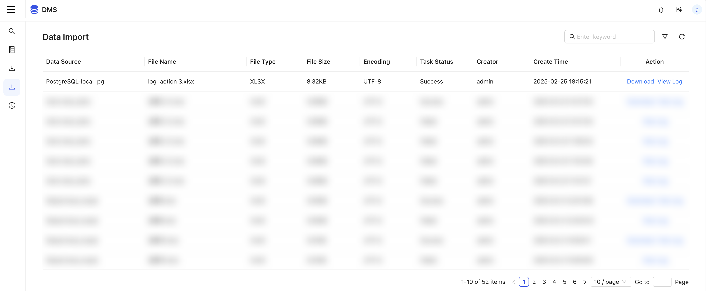
## Run History
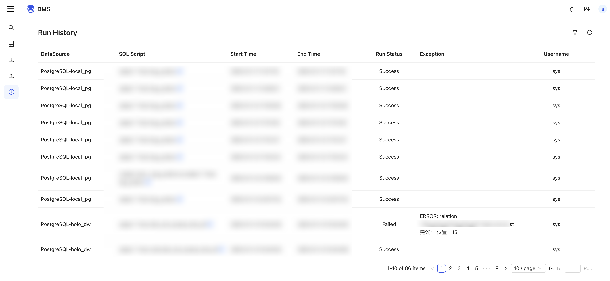