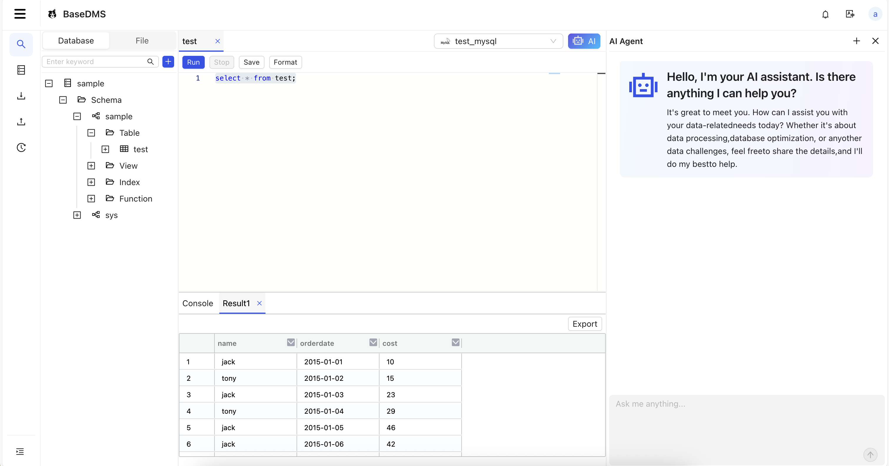

# Introduction

Base DMS is an open-source, free, and AI-powered intelligent data management system. It provides a web-based SQL editor for querying and managing database objects, and supports AI assisted development. Currently, it is compatible with multiple databases including MySQL, Oracle, PostgreSQL, Apache Doris, and more.

## Features

- **User-friendly**: Provides a graphical web interface for intuitive and simple operation
- **Database Management**: Supports common databases such as MySQL, Oracle, PostgreSQL, and more
- **SQL Editor**: Offers a web-based SQL editor for online querying, with code suggestions and SQL file management
- **AI Integration**: Enables AI LLM configuration and provides conversational AI assistance for development
- **Import/Export**: Supports data import/export operations, with split configuration for exporting large tables
- **SQL Auditing**: Tracks historical SQL execution records for administrator auditing and traceability

## Try DMS

[Get Started](./start/quickStart.md) Quickly to Learn How to Use DMS
