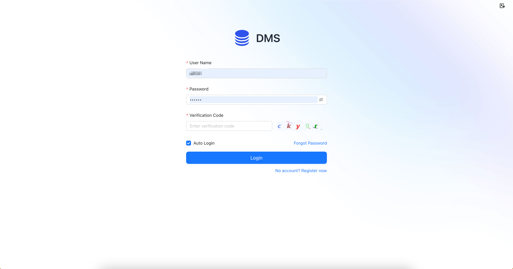

# Quick Start
## Install Docker
Visit [Docker Official Website](https://www.docker.com/) download and install Docker Desktop
## Start DMS
1. Create or download [docker-compose.yml](https://github.com/basedt/dms-web/blob/main/docker/docker-compose.yml) file
```yaml

services:

  db:
    image: postgres:15.1-alpine
    container_name: dms_postgres
    restart: always
    environment:
      POSTGRES_USER: root
      POSTGRES_PASSWORD: 123456
      POSTGRES_DB: dms
    ports:
      - 5432:5432
    volumes:
      - ./db/data:/var/lib/postgresql/data
    healthcheck:
      test: ["CMD", "pg_isready", "-q", "-d", "dms", "-U", "-u$$POSTGRES_USER"]
      interval: 30s
      timeout: 5s
      retries: 3
      start_period: 10s
    networks:
      - dms
  redis:
    image: redis:7.0.7
    container_name: dms_redis
    restart: always
    ports:
      - 6379:6379
    networks:
      - dms
  dms_backend:
    image: registry.cn-hangzhou.aliyuncs.com/basedt/dms-backend:v1.0.0
    container_name: dms-backend
    depends_on:
      redis:
        condition: service_started
      db:
        condition: service_healthy
    healthcheck:
      test: [ "CMD", "curl", "-f", "http://dms-backend:8080/dms/api/health/status" ]
    ports:
      - 8080:8080
      - 8085:8085
    networks:
      - dms
  dms-frontend:
    image: registry.cn-hangzhou.aliyuncs.com/basedt/dms-frontend:v1.0.0
    container_name: dms-frontend
    depends_on:
      dms_backend:
        condition: service_healthy
    ports:
      - 80:80
    networks:
      - dms

networks:
  dms:
    driver: bridge
```
2. Run following command to start the project
```shell
docker compose -p dms up -d
```
3. Open your browser and visit http://localhost to access dms. After successful access, you can register an account or log in with admin account (admin/123456).

