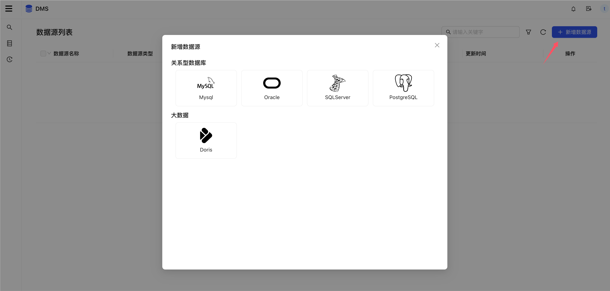
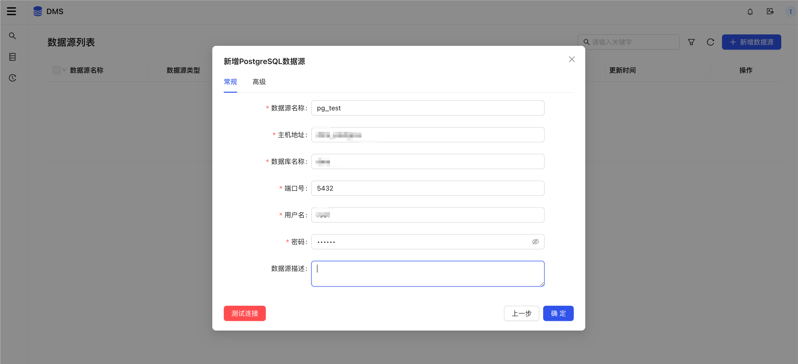
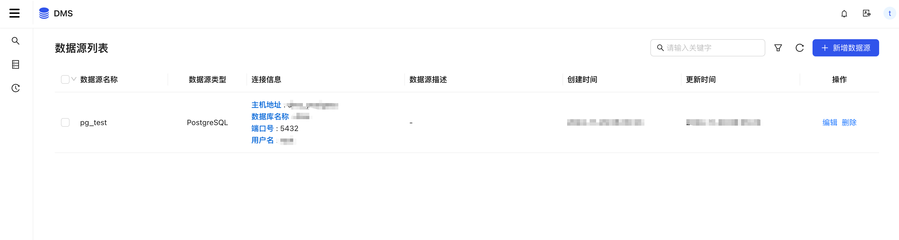

# 数据源管理

## 支持数据源

| 类型     | 数据库          |
|--------|--------------|
| 关系型数据库 | Mysql        |
| 关系型数据库 | Oracle       |
| 关系型数据库 | PostgreSQL   |
| 关系型数据库 | SQL server   |
| MPP数据库 | Apache Doris |

## 创建数据源
1. 选择数据源类型

2. 新增数据源，以PostgreSQL为例

3. 点击测试连接，成功后即可
