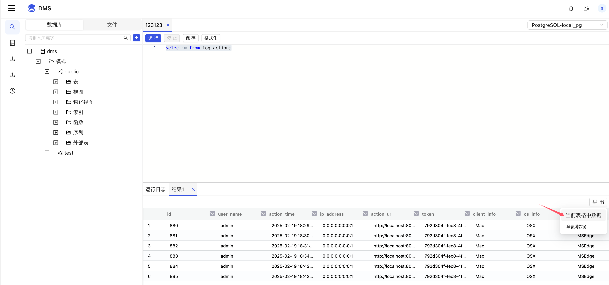
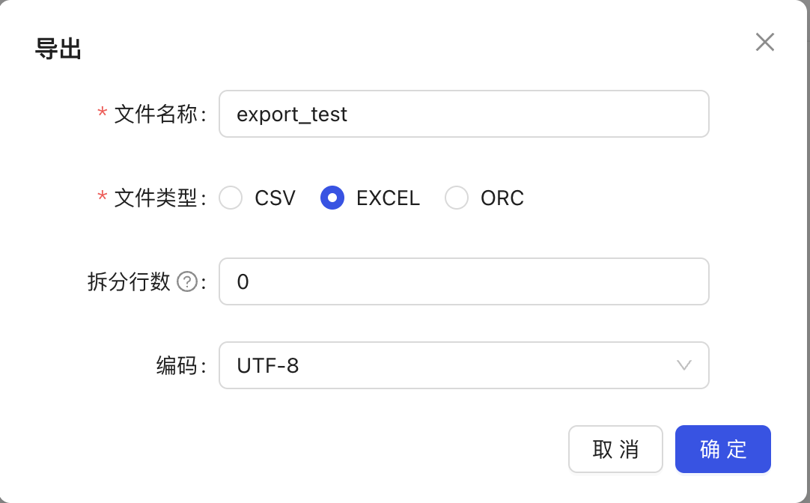
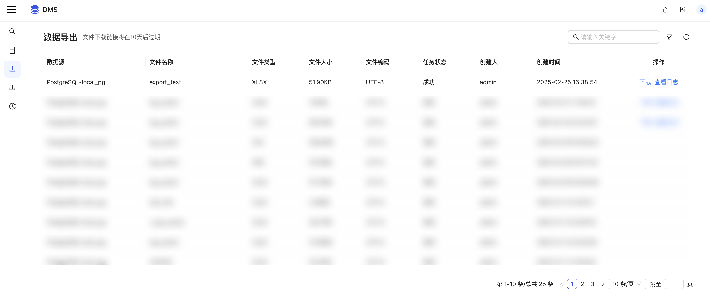
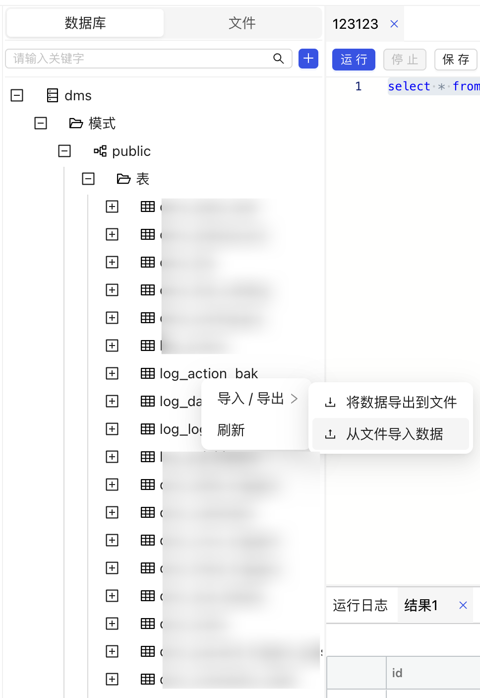
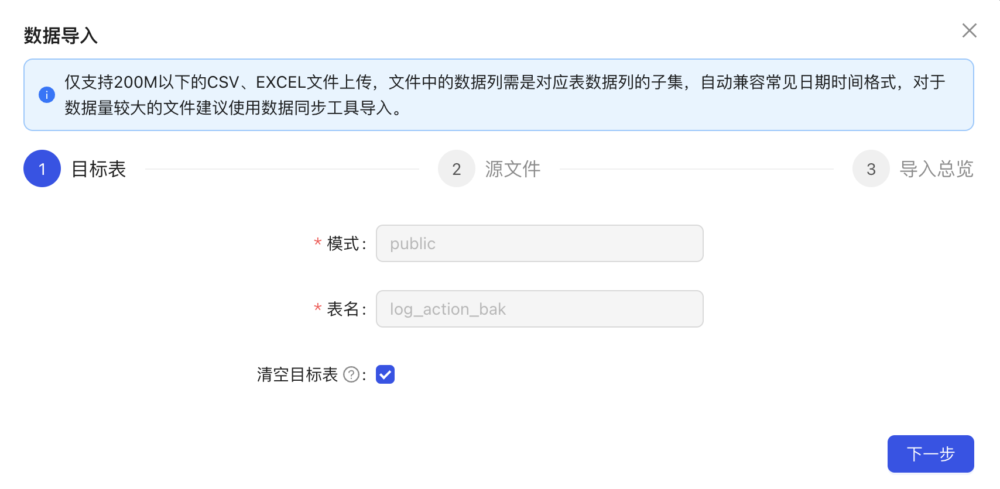
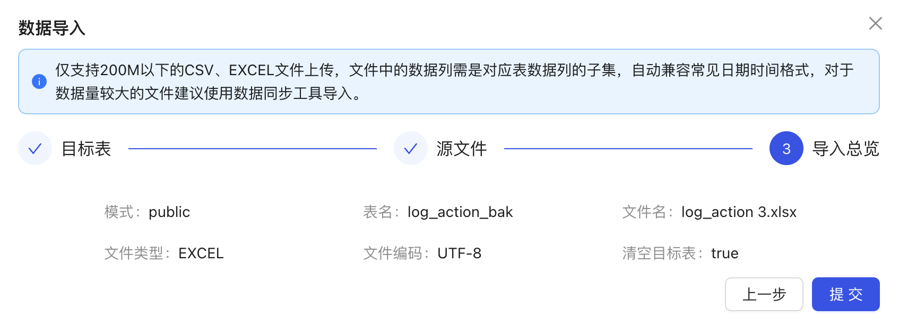
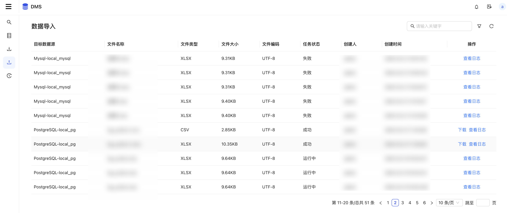
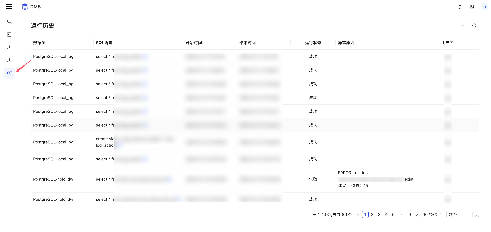

# SQL查询

## 选择数据源
打开工作空间后，会自动弹出数据源选择界面，可下拉选择空间下的数据源

## 创建文件
可在数据库对象列表中快捷创建文件，或者在文件列表中右键创建

## SQL查询

## 数据导出
获取到查询结果后，点击导出可选择“当前表格中数据”或者“全部数据”，当前表格中数据只会导出前端展示的数据，全部数据则会生成后台导出任务，完成后再手动下载

选择导出全部

查看导出结果

## 数据导入
右键点击表或者视图，菜单中选择导入/导出 => 从文件导入数据

选择是否清空目标表

选择文件

预览

查看导入结果

## 运行历史
