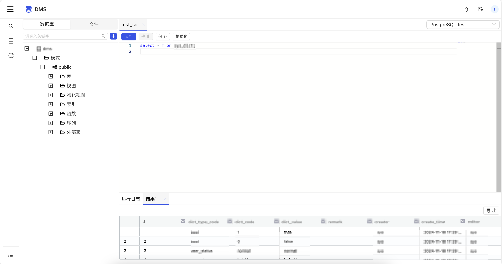

# 简介
Basedt DMS是一个免费、简单、易用的数据管理系统，支持在浏览器中通过Web SQL 编辑器对数据库进行操作和管理。目前已适配支持Mysql、Oracle、PostgreSQL、Apache Doris等数据库。

## 功能特性
- 简单易用：提供图形化的WEB界面，操作方便简单
- 数据库管理：支持常见的Mysql、Oracle、PostgreSQL等多种数据库
- SQL查询：以Web SQL 编辑器方式进行在线查询，支持SQL文件管理和查询结果导出等功能
- SQL审计：支持查询历史SQL执行记录，便于管理员跟踪审计
- 一键部署：提供docker镜像，可通过一条命令完成安装部署

## 尝试DMS
进入[快速开始](./start/quickStart.md)了解如何使用DMS